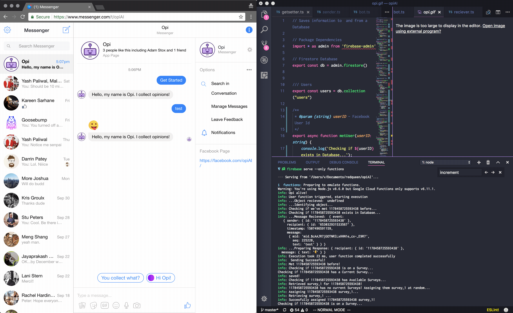
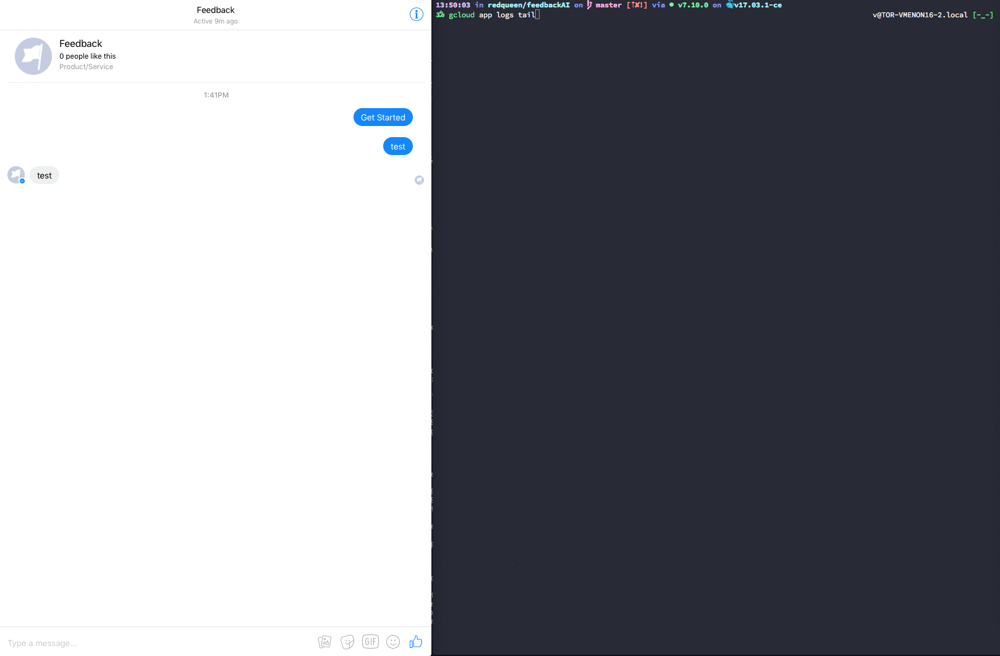

# opiAI
Opi is currently an Alpha-stage Facebook Messenger Bot hosted serverlessly via Node Firebase Cloud Functions bot, from transpiled TypeScript. 

[Feel free to go say hi!](https://www.messenger.com/t/opiAI) 

## Goal
The end goal with Opi was to simply build a comfortable digital experience to acquire qualititative data from human users on Facebook. 

We hope to build a responsive, engaging Messenger bot experience that will encourage users to provide their opinions, in order to democratize data, discover semantic/qualitiative relationships between users and brands, acquire first-party fan feedback, and (eventually) train artifical intelligence agents focused on conversation.

## History

This project was originally `feedbackAI`, and was basically just a fork of the quickstart template providded by [Messenger Platform docs](https://developers.facebook.com/docs/messenger-platform/guides/quick-start) on [Glitch](https://developers.facebook.com/docs/messenger-platform/guides/quick-start).