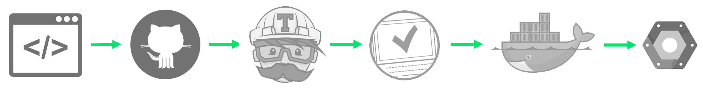

# opiAI
Opi is an alpha-stage survey bot acccessible through Facebook Messenger, and hosted on Google Cloud and Firebase, built with NodeJS. [Feel free to go say hi!](https://www.messenger.com/t/opiAI) 

## Goal
The end goal with Opi was to simply build a comfortable digital experience to acquire qualititative data from human users on Facebook. 

We hope to build a responsive, engaging Messenger bot experience that will encourage users to provide their opinions, in order to democratize data, discover semantic/qualitiative relationships between users and brands, acquire first-party fan feedback, and (eventually) train artifical intelligence agents focused on conversation.

This (rudimentry) demo can currently ask you how you feel about the [Tesla M3](https://www.tesla.com/en_CA/model3), but we hope to get it do more real soon.

## History

This project was originally `feedbackAI`, and was basically just a fork of the quickstart template providded by [Messenger Platform docs](https://developers.facebook.com/docs/messenger-platform/guides/quick-start) on [Glitch](https://developers.facebook.com/docs/messenger-platform/guides/quick-start).

This project is also being used to test the **Continous Integration / Continuous Deployment (CI/CD)** paradigm using:
1. `git` as the VCS.
2. Github as the collaborate development platform. 
3. Better Code Hub & `mocha` for testing.
4. Docker to containerize and register build versions.
5. Google App Engine with a `custom:flex` to deploy build versions. 

This is a working application of the [excellent guide I found here](https://medium.com/bettercode/how-to-build-a-modern-ci-cd-pipeline-5faa01891a5b), and is still under active and heavy experimentation.

## Dependencies  
There are several known build issues that are under active development. Feel free to flag or PR if you have questions/suggestions.

### Codebase
    Node v7.10.0
    Docker version 17.03.1-ce, build c6d412e
    Google Cloud SDK 158.0.0
    Firebase CLI 3.9.2

### Node
    "@google-cloud/debug-agent": "^2.0.0",
    "@google-cloud/logging-winston": "^0.5.0",
    "@google-cloud/trace-agent": "^2.1.2",
    "body-parser": "^1.17.1",
    "express": "^4.15.3",
    "express-winston": "^2.4.0",
    "firebase-admin": "^4.2.1",
    "nodemon": "^1.11.0",
    "request": "^2.81.0",
    "winston": "^2.3.1"
    "@google-cloud/nodejs-repo-tools": "1.3.1",
    "eslint": "^4.3.0",
    "eslint-config-google": "^0.9.1"
