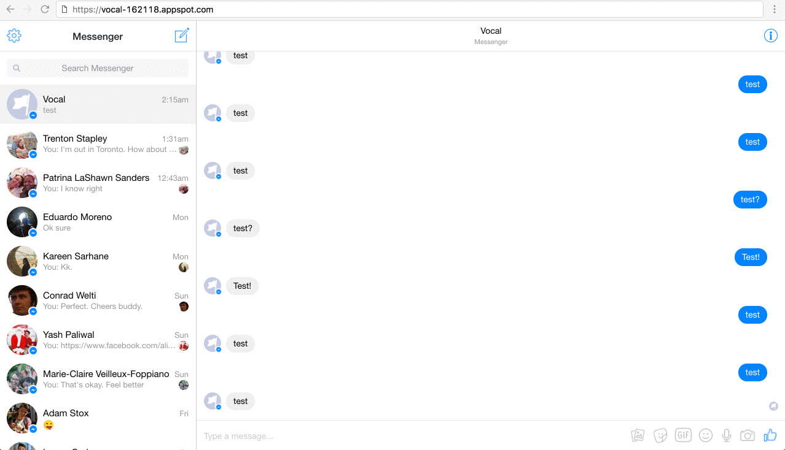

# Facebook Messenger Bot Test

This example project creates a Facebook Messenger bot, mirroring the quickstart located in [Messenger Platform docs](https://developers.facebook.com/docs/messenger-platform/guides/quick-start) and borrowed straight from the setup on [Glitch](https://developers.facebook.com/docs/messenger-platform/guides/quick-start) with a couple tweaks to work with [Google App Engine](https://cloud.google.com/appengine/docs/).

For more detailed setup instructions, see [Messenger Platform Quick Start](https://developers.facebook.com/docs/messenger-platform/guides/quick-start).

## Setup 

This is an an echo bot that responds to a user's message by repeating their message back to them. It also sends a generic template when a message with "generic" text is received. This project is not dependent on any external libraries and can easily be extended.

This repo is also self-contained for interaction with GAE, and can be accessed via the [GCloud SDK](https://cloud.google.com/sdk/) with appropriate permissions. 

This is what has been implemented so far:

- [x] Setting up our [Facebook Page](https://www.facebook.com/Vocal-1226907177358234/) and [Facebook App](https://developers.facebook.com/apps/1864264410512639/dashboard/).

- [x] Copying our app credentials into the `.env` file

- [x] Setting up the [Node/Express server on GAE](https://vocal-162118.appspot.com) with a (working -_-) `/webhook` for callbacks.
 
- [x] Configure your Facebook App with the right messaging permisions, Callback URL and Verify Tokens. 

- [ ] Playing with the new [bot!](https://www.messenger.com/t/feedbackAI/)