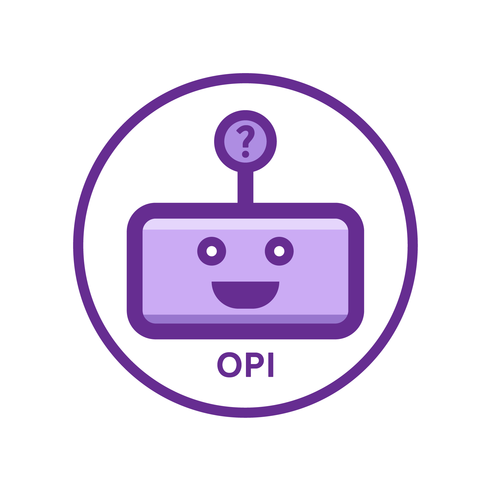

# opiAI
## `web/`

[](https://m.me/opiAI)

Opi is a beta-stage Facebook Messenger Bot that collects opinions, built out of TypeScript and hosted on Firebase. In this branch we'd like to build his frontend!


### Goal
Productize Opi with:
* A Client Dashboard with live visualizations of survey results from Firestore.
* A Client Onboarding Process consisting of 3 steps (Survey Description+ Demo targeting, Question creation, Stripe Payment) .
* General design face lift and optimization.

### Scope
• Re-Implement Firebase Auth service in React.
• Dashboard with each “Survey” (project) the user has created.
• A form with the ability to create a survey with multiple questions with multiple
choices each.
• Data integration with Facebook / Backend API when configuring the Facebook
Ad / Targeted User Segment.
• Stripe integration for purchasing survey ad-spend.
• Real-time dashboard that shows results of an active / completed survey with per-
question analytics and charts.
• Light design facelift.

### Stack
```javascript
react (tbd)
redux (tbd)
```

Built in partnership with [Mokko Labs](http://mokko.io/).